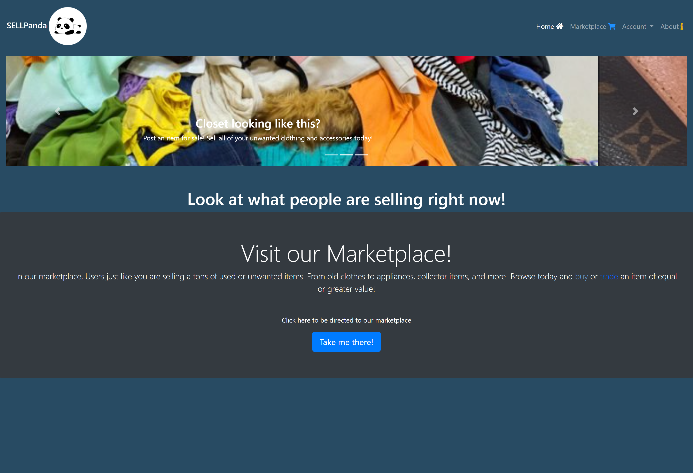
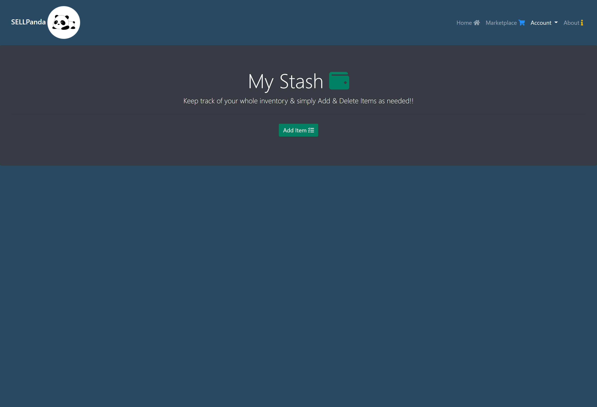
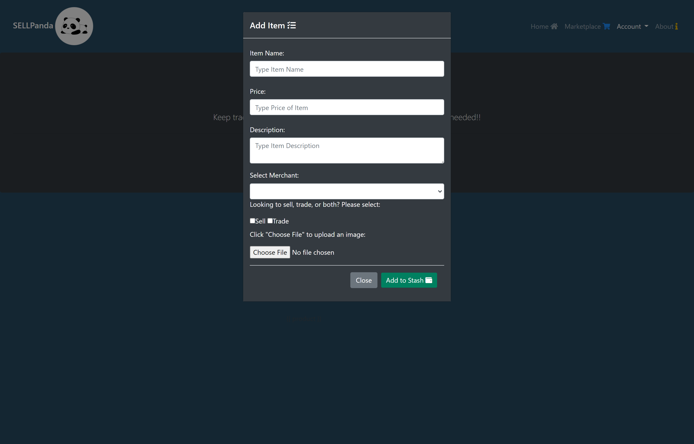
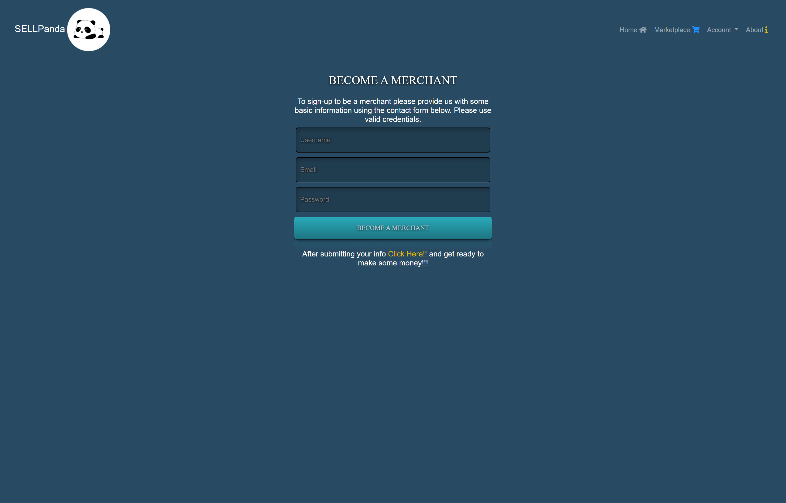

# Project2Group2

## Description

It's 2020 and everything is online especially if you're interested in picking up some new things or making some money and that's where we come in as with our app we can help you with both!! Are you looking to trade or sell items??? We've got you covered with that!!! Here at SELLPanda you can search and find all the hottest new deals at great prices. Browse the Marketplace to buy items or if you have items of value you can sell or trade them as you'd like request for others to accept.

## User Story

```
AS A user, I want to be able to buy or trade items

I WANT to be able to add and delete items that I have

SO THAT I can organize my inventory and keep track of it all
```

## Table of Contents

* [Usage](#usage)

* [Contributing](#Contributing)

* [Heroku Link](#heroku)

* [ScreenShots of Completed App](#screenshots)

* [Contact](#contact)

## Usage

The main purpose of this app is for users that have items that they are looking to either sell or trade. Our app offers them the ability to list their items for other users to see and potentially buy or trade for it. To be able to list or trade products users will first have to become merchants through our SignUp Page but if someone is just looking to buy that won't be necessary. Users can buy from the Marketplace and list their items through they Activesales page. 

## Contributing

If you are interested in contributing to this app please contact the owner of this repo via email. If given approval please follow these steps:

* Fork this repository.
* Create a branch: git checkout -b <branch_name>.
* Make your changes and commit them: git commit -m '<commit_message>'
* Push to the original branch: git push origin <project_name>/<location>
* Create the pull request.

Alternatively see the GitHub documentation on [creating a pull request](https://docs.github.com/en/free-pro-team@latest/github/collaborating-with-issues-and-pull-requests/creating-a-pull-request).

## Heroku

Please check out the following link to see the finished product:

[Deployed App](https://project2-group2.herokuapp.com/home.html)

## ScreenShots











## Contact
If you have any questions regarding this project and would like to reach out to us please feel free to do so at the following email: sellpandasupport@sellpanda.com. Thank you.

Check Out Our Teams Github Pages:

[Andrew](https://github.com/Crozarts)

[Dimitar](https://github.com/dspark8916)

[Matt](https://github.com/MatthewSmith23)

[Steve](https://github.com/sgalarza419)